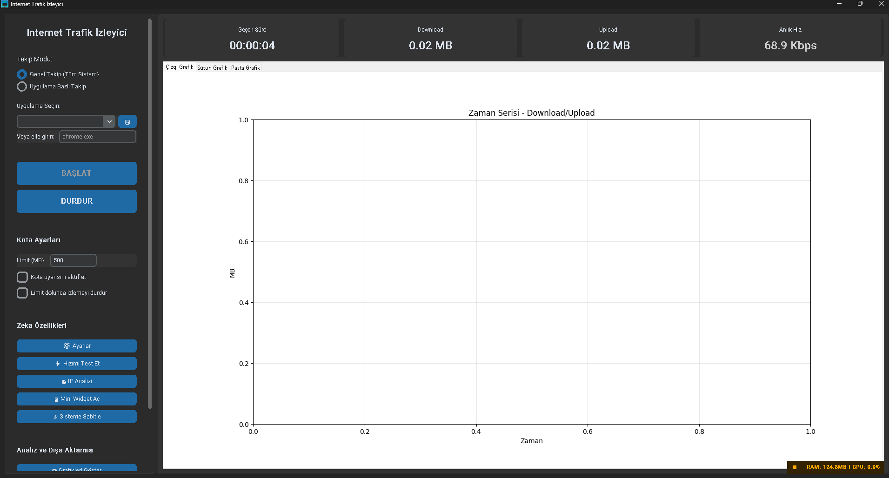
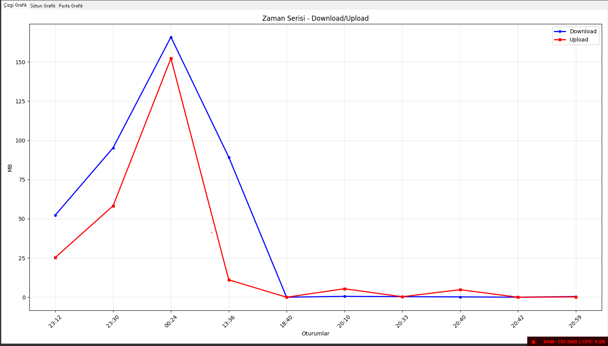
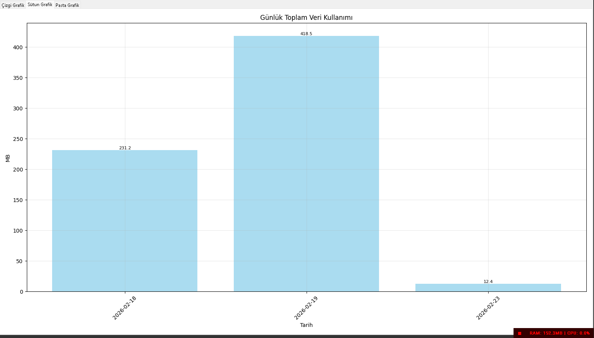
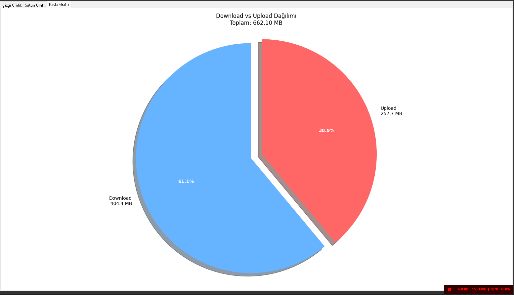
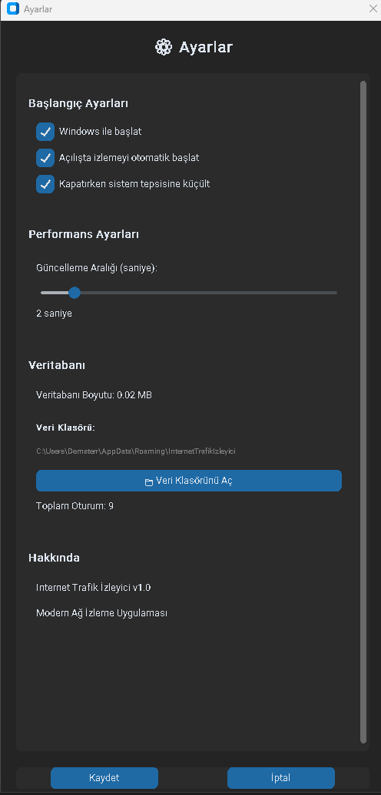
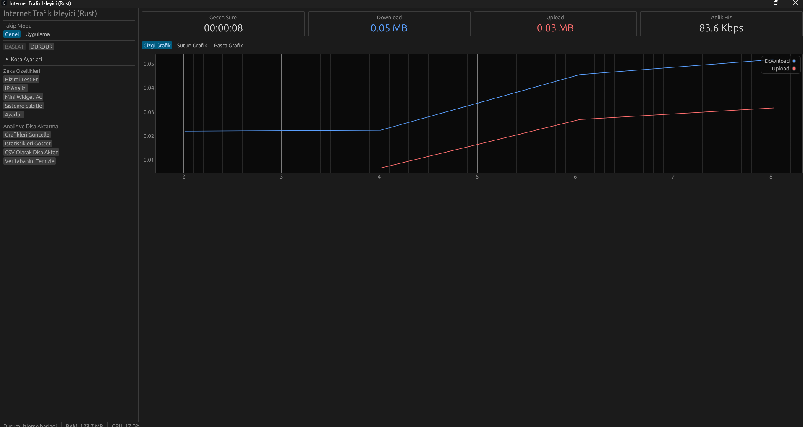
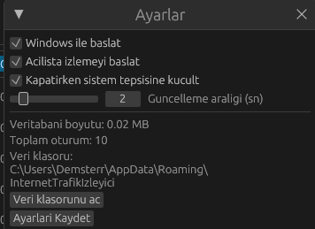

# 🌐 Internet Trafik Ä°zleyici

Modern ve kullanıcı dostu bir internet trafik izleme uygulaması. Gerçek zamanlı ağ kullanımınızı takip edin, analiz edin ve kontrol altında tutun.


## ✨ Özellikler

### 📊 Temel Özellikler
- **Gerçek Zamanlı İzleme**: Anlık download/upload hızı ve toplam veri kullanımı
- **Ä°ki Ä°zleme Modu**:
  - Genel Takip: Tüm sistem trafiği
  - Uygulama Bazlı: Belirli uygulamaların (Chrome, Discord, vb.) trafiği
- **Akıllı Uygulama Seçici**: Çalışan uygulamaları otomatik listeler
- **Kota Yönetimi**: Veri limiti belirleyin, uyarı alın
- **Otomatik Kayıt**: Tüm oturumlar SQLite veritabanına kaydedilir

### 📈 Analiz ve Raporlama
- **3 Farklı Grafik Türü**:
  - Çizgi Grafik: Zaman serisi analizi
  - Sütun Grafik: Günlük toplam kullanım
  - Pasta Grafik: Download vs Upload dağılımı
- **İstatistikler**: Toplam oturum, süre, veri kullanımı
- **CSV Dışa Aktarma**: Excel uyumlu veri dışa aktarma

### 🚀 Gelişmiş Özellikler
- **Hız Testi**: Gerçek internet hızınızı ölçün
- **IP Analizi**: Public/Local IP ve aktif bağlantıları görüntüleyin
- **Mini Widget**: Sürüklenebilir, şeffaf hız göstergesi
- **Sistem Tepsisi**: Arka planda çalışma desteği
- **Windows Başlangıç**: Otomatik başlatma seçeneği
- **RAM/CPU Göstergesi**: Uygulamanın kaynak kullanımını izleyin

### ⚙️ Ayarlar
- Windows ile baÅŸlat
- Otomatik izleme baÅŸlat
- Sistem tepsisine küçült
- Güncelleme aralığı (1-10 saniye)
- Veri klasörü yönetimi

## 🖼️ Ekran Görüntüleri

### Ana Ekran


### Grafikler




### Ayarlar


### Rust (Opsiyonel)



## 📥 Kurulum

### Hazır EXE (Önerilen)
1. [Releases](../../releases) sayfasından son sürümü indirin
2. `InternetTrafikIzleyici.exe` dosyasını çalıştırın
3. İlk çalıştırmada Windows Defender uyarı verebilir:
   - "Daha fazla bilgi" → "Yine de çalıştır"

### Kaynak Koddan Çalıştırma
```bash
# Gerekli kütüphaneleri yükleyin
pip install customtkinter psutil matplotlib pillow pystray win10toast requests

# Uygulamayı çalıştırın
python internet_trafik_izleyici.py
```

### Kendi EXE'nizi OluÅŸturun
```bash
# PyInstaller'ı yükleyin
pip install pyinstaller

# EXE oluÅŸturun
python build_exe.py
```

## 💾 Veri Depolama

Tüm veriler güvenli bir konumda saklanır:
```
C:\Users\[KullanıcıAdı]\AppData\Roaming\InternetTrafikIzleyici\
├── internet_traffic.db  (Veritabanı)
└── settings.json        (Ayarlar)
```

Bu sayede uygulamayı silseniz bile verileriniz güvende kalır.

## 🛠️ Teknolojiler

- **Python 3.11**: Ana programlama dili
- **CustomTkinter**: Modern GUI framework
- **psutil**: Sistem ve aÄŸ izleme
- **matplotlib**: Grafik ve görselleştirme
- **SQLite**: Veritabanı yönetimi
- **PyInstaller**: EXE paketleme

## 📋 Sistem Gereksinimleri

- **Ä°ÅŸletim Sistemi**: Windows 10/11
- **RAM**: Minimum 100 MB
- **Disk**: 100 MB boÅŸ alan
- **Python**: 3.11+ (kaynak koddan çalıştırma için)

## 🎯 Kullanım Senaryoları

- 📱 **Mobil Hotspot Kullanıcıları**: Veri kotanızı aşmayın
- 🎮 **Oyuncular**: Hangi oyunun ne kadar veri harcadığını görün
- 💼 **Uzaktan Çalışanlar**: İş uygulamalarınızın veri kullanımını takip edin
- 🏠 **Ev Kullanıcıları**: Aylık internet kotanızı yönetin
- 🔍 **Meraklılar**: Ağ trafiğinizi detaylı analiz edin

## 🤝 Katkıda Bulunma

Katkılarınızı bekliyoruz! Lütfen şu adımları izleyin:

1. Fork yapın
2. Feature branch oluÅŸturun (`git checkout -b feature/AmazingFeature`)
3. DeÄŸiÅŸikliklerinizi commit edin (`git commit -m 'Add some AmazingFeature'`)
4. Branch'inizi push edin (`git push origin feature/AmazingFeature`)
5. Pull Request açın

## 📝 Lisans

Bu proje MIT lisansı altında lisanslanmıştır. Detaylar için [LICENSE](LICENSE) dosyasına bakın.

## 🐛 Hata Bildirimi

Bir hata mı buldunuz? [Issues](../../issues) sayfasından bildirebilirsiniz.

## 📧 İletişim

Sorularınız için issue açabilir veya pull request gönderebilirsiniz.

## 🌟 Yıldız Verin!

Bu projeyi beğendiyseniz, lütfen ⭐ vererek destek olun!

---

**Not**: Bu uygulama sadece izleme amaçlıdır. Ağ trafiğini engellemez veya değiştirmez.

